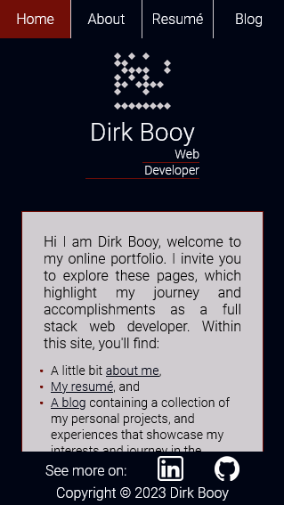

# DirkBooy-T1A2-Portfolio

## Contents
1. [Link to portfolio website](#1-published-portfolio-website-link) 
    
1. [Link to GitHub repo](#2-github-repository-link)

1. [Description of portfolio website](#3-description-of-portfolio-website)  
    3.1. [Purpose](#31-purpose)  
    3.2 [Functionality / features](#32-functionality--features)  
    3.3 [Sitemap](#33-sitemap)  
    3.4 [Screenshots](#34-screenshots)  
    3.5 [Target audience](#35-target-audience)  
    3.6 [Tech stack](#36-tech-stack)  

## 1. Published Portfolio Website Link  
[https://dirk-booy-t1-a2-portfolio.vercel.app/](https://dirk-booy-t1-a2-portfolio.vercel.app/)

## 2. GitHub Repository Link
[https://github.com/dtbooy/DirkBooy-T1A2-Portfolio](https://github.com/dtbooy/DirkBooy-T1A2-Portfolio)

## 3. Description of portfolio Website
### 3.1 Purpose  
The purpose of this website is to showcases my talent, abilities and coding experience as a way to communicate and demonstrate your abilities to prospective employers.   
### 3.2 Functionality / features

1. Responsive Design: The website is designed to be responsive and adapt to various devices, utilising CSS media queries for different screen sizes an CSS flexbox for adaptive elements.

1. Content: The content is organized logically into small sections which assist in consumption and re-aligning the layout to responsively adapt to different media devices 

1. Semantic HTML: The code uses semantic HTML elements to help with accessibility and search engine optimization.

1. Images: All images have alt attributes, which is crucial for accessibility. However, the images themselves weren't provided, so I couldn't assess the content of the images.

1. Favicon: A favicon linked to the website, which assists in branding and user recognition.

1. Navigation: The navigation bar provides ease of accessibility to different sections of the website.

1. Downloadable Resume: a link to download my resume is provided, which is a useful feature for potential employers or collaborators.

1. External Links: Links to my LinkedIn and GitHub profiles open in new tabs, making it convenient for users to explore my online presence.

### 3.3 Sitemap & wireframes
Site Map

Wireframe - Page Framework
  
Wireframe - index.html
  
Wireframe - about.html
  
Wireframe - resume.html
  
Wireframe - blog.html
  

### 3.4 Screenshots
#### index.html
index.html - Full Page (Mobile)  
  
index.html - Mobile  
   
index.html - Mobile (landscape)  
  
index.html - Tablet  
  
index.html - Desktop  
  
#### about.html
about.html - Full Page (Mobile)  
  
about.html - Mobile  
  
about.html - Tablet  
  
about.html -Desktop  
  
#### resume.html
resume.html - Full Page (Mobile)  
  
resume.html - Mobile  
  
resume.html - Tablet  
  
resume.html - Desktop  
  
#### blog.html
blog.html - Full Page (Mobile)  
  
blog.html - Mobile  
  
blog.html - Tablet  
  
blog.html - Desktop  
  
### 3.5 Target audience
The target audience is recruiters, potential employers and co-workers. 

### 3.6 Tech stack 
* Website 
    * HTML
    * CSS
* Deployment Platform - Vercel

